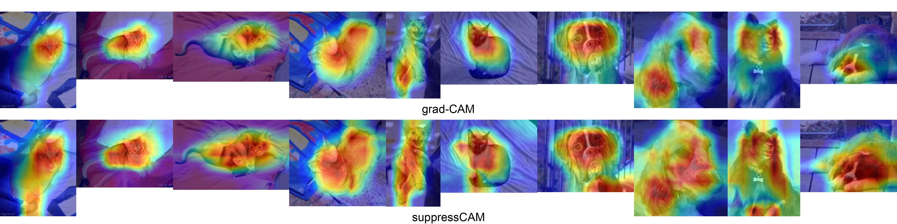

# Grad-CAM-based Psuedo Labels Generation for Weakly Supervised Semantic Segmentation (WSSS)

This section implements a grad-CAM algorithm as well as its novel variant **SuppressCAM**, for psuedo labels generation in WSSS. 

## 🔧 Method: SuppressCAM  
We propose **SuppressCAM**, a simple workflow to visualize feature suppression in neural networks by:  
1. Computing Grad-CAM with negated gradients for false classes.  
2. Aggregating via element-wise max pooling.  
SuppressCAM identifies the features that most suppress false classes, thereby generating more comprehensive object localization maps.


---

## 👀 Visualise grad-CAM/SuppressCAM results

```bash
python scripts/train_classifier.py

python scripts/generate_cam.py
```

---

## 🧪 Generate Pseudo Masks

```bash
python scripts/train_classifier.py

python scripts/generate_cam.py
```

---


## 🆕 Features

- make uses of training and validation sets
- Supports mobilenet_v3_small or ResNet18 for classification
- Optional regularisations of early stop, mix-up
- Uses grad-CAM and negative grad-CAM for localization
- Generate pseudo masks and compute mIoU


---

## 🐱🐶 Results

SuppressCAM captures more features comparing to vanila grad-CAM

---

## 🕙 ToDos
- Heuristicly filter out bad pseudo masks by sparsity of the activation area
- Tune hyper-parameters of classifer training and suppressCAM false classes set

---